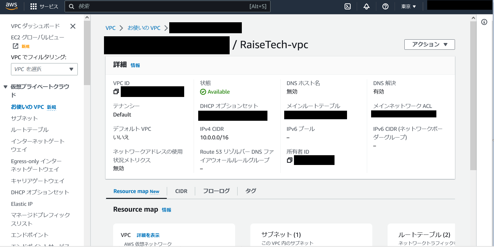
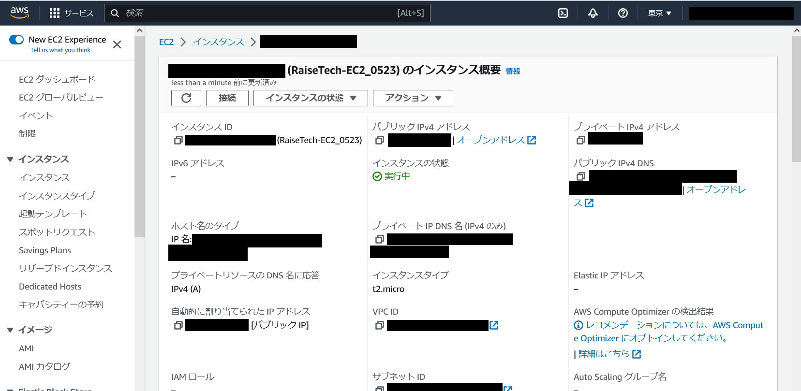
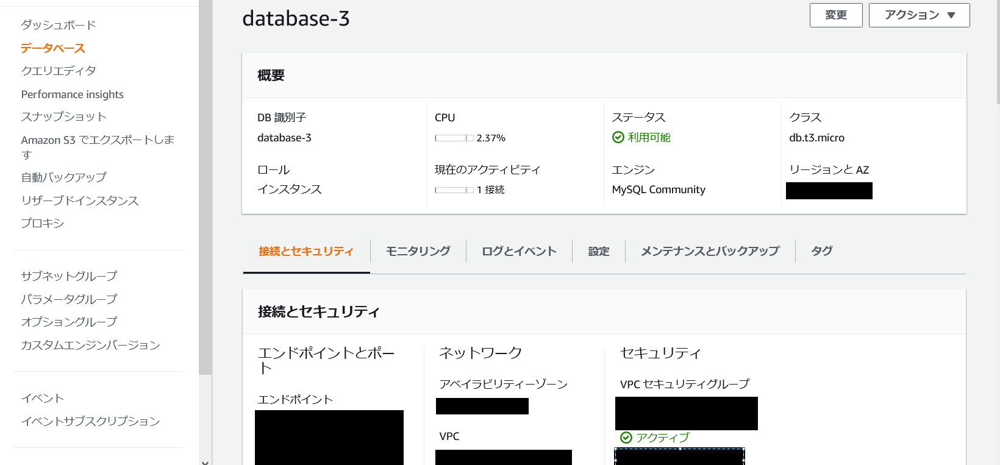
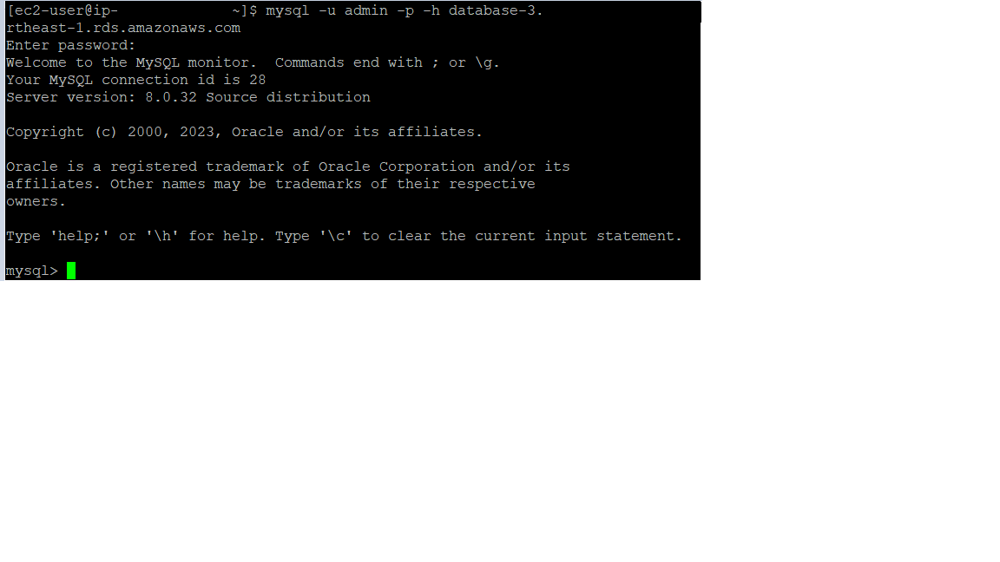

# 第４回課題

## VPC構築

## EC2構築

## RDS構築

## RDS接続

---

# 所感

* まず初めにTeraTermを使ってEC2をSSH接続しようとしたが、接続できず失敗。そこで、PuTTYを使ってEC2にSSH接続したが、なんとか接続できた。

* PuTTY上でMySQLをinstallできずひたすら悩んだ。どうやらAmazon Linux2023を選んでいたのが原因のよう。

* InternetGatewayやRouteTableをVPCに紐づけるのを忘れていたので、これらを紐づける方法を調べた。
　
* VPCやEC2といったAWS特有の用語はもちろん、IPアドレスなど基本的なIT知識もしっかり固めないといけないと感じた。