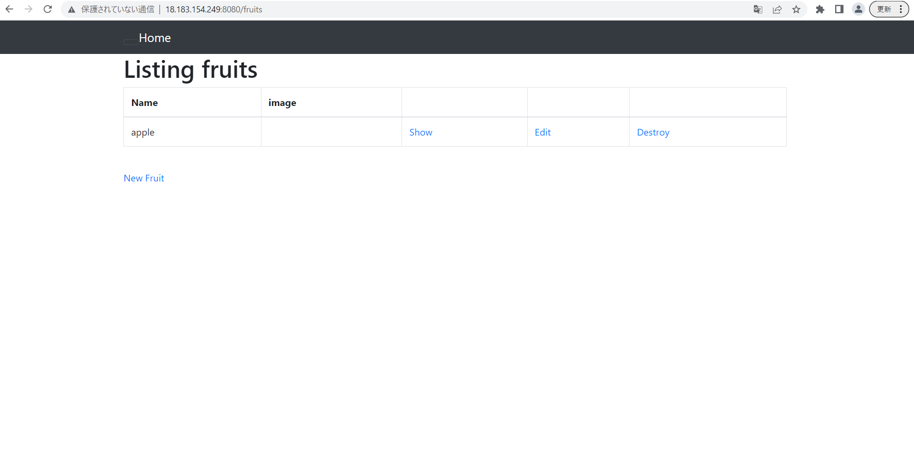
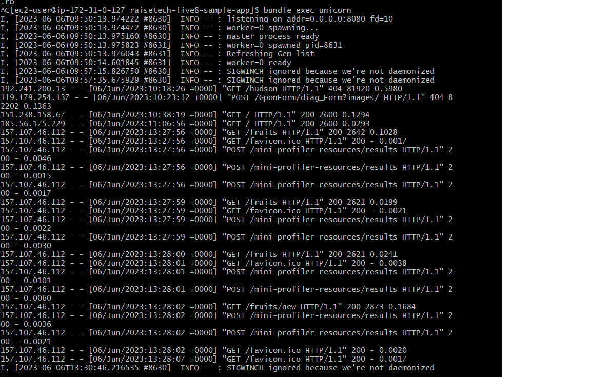
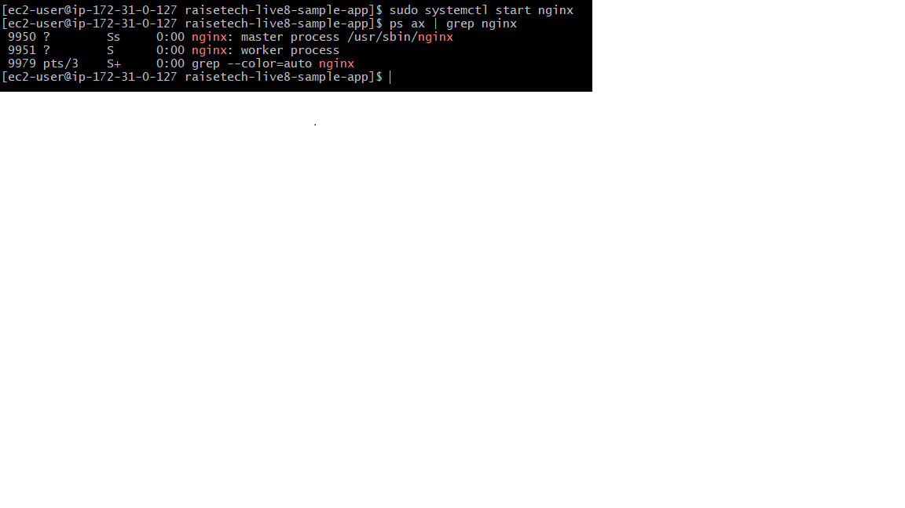
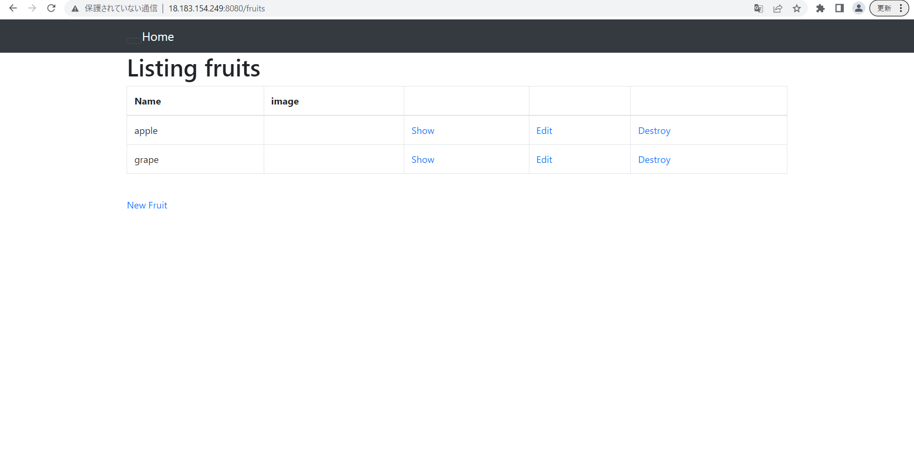
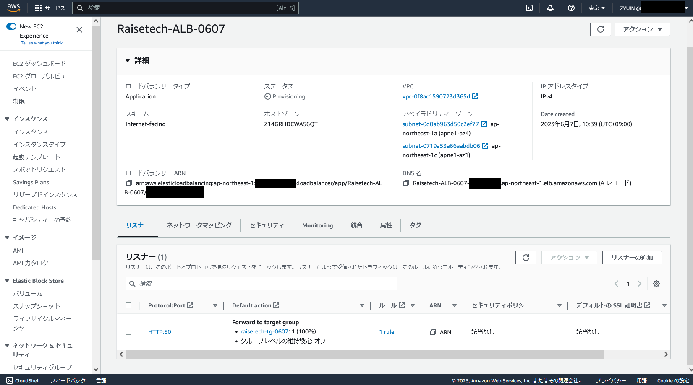
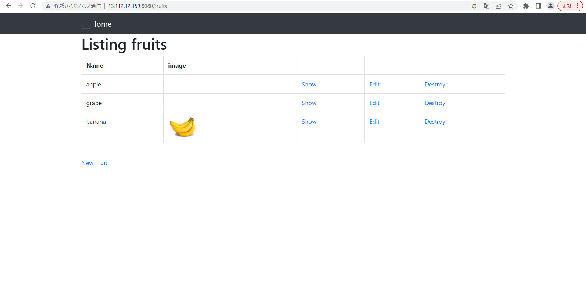
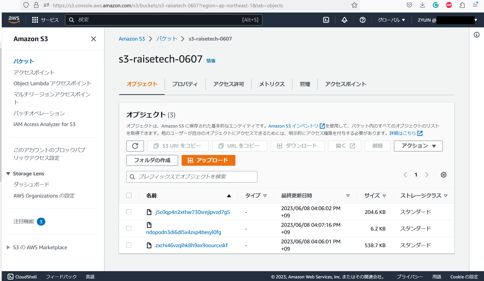

# 第5回課題

## puma

## Unicorn

## Nginx

## Unicorn＆Nginx

## ALB

## S3

## 構成図

---

# 所感

* Cloud9ではなくGitBashを使うだけで難易度がぐっと上がった印象。

* pumaを起動させるまでが大変苦戦した。でもエラーの対処には少し慣れてきた。

* アプリケーションで投稿した画像がS3にアップロードできた時は感動した。

* 第５回の課題で２週間かかってしまったので巻き返していきたい。