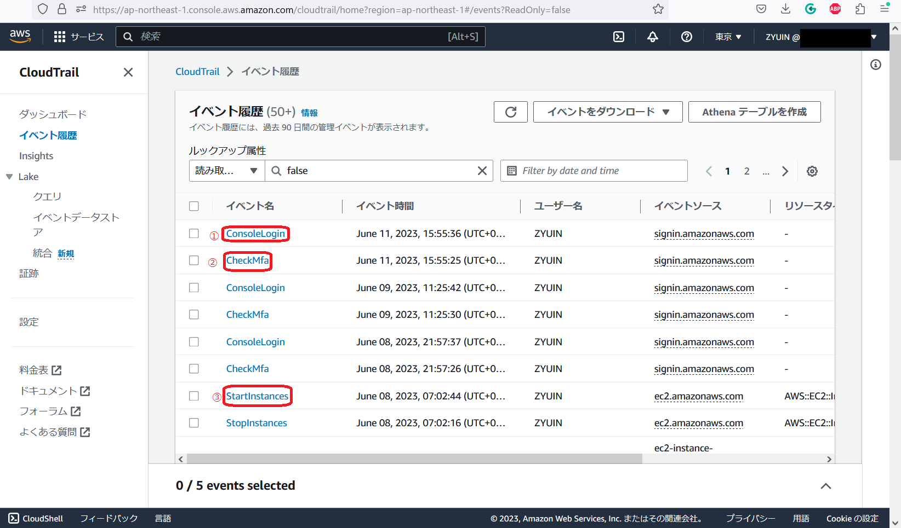

# 第6回課題

## CloudTrail
 

### CloudTrailイベント履歴
* AWSを最後に利用した日：6/11 
* イベント履歴にあるイベント名 
①ConsoleLogin
②CheckMfa
③StartInstances

### ConsoleLogin

### CheckMfa

### StarnInstances

### イベント履歴に書かれていること
①eventtime 
リクエストが完了した日付と時刻を示し、API コールが行われた 
サービスAPI エンドポイントを提供するローカルホストから取得する。
 

②userAgent 
AWS Management Console、AWS CLI など、リクエストが行われたエージェント。 
今回の場合はMozilla/5.0なので、Firefoxからリクエストが行われたと記載されている。

③eventtype 
イベントレコードを生成したイベントのタイプを識別するためのもの。 
今回の場合はAwsConsoleSignInなので、AWSアカウントユーザーが 
AWS Management Consoleにサインインしたというeventtype。

## CloudWatchアラーム

### Railsアプリケーションが使える状態
①ターゲットのヘルスチェック

②CloudWatchアラーム

③AmazonSNSアクション

### Railsアプリケーションが使えない状態
①ターゲットのヘルスチェック

②CloudWatchアラーム

③AmazonSNSアクション

## AWS使用料の見積
①EC2 
https://calculator.aws/#/estimate?id=76c8674c2dbdca07c0190ba1ca9aefb8de74658e

②RDS 
https://calculator.aws/#/estimate?id=296f294c06853362d9213322babdc47f21dc94e5

③S3 
https://calculator.aws/#/estimate?id=3c894de9ae786b40a52752af22ab715ed7b8ae63

④ALB 
https://calculator.aws/#/estimate?id=98758b11cf231cb13b087da4cdc34a9ddcad2e43

## AWS使用料
①現在の利用料 

②先月のEC2の使用料 

③無料利用枠の確認

