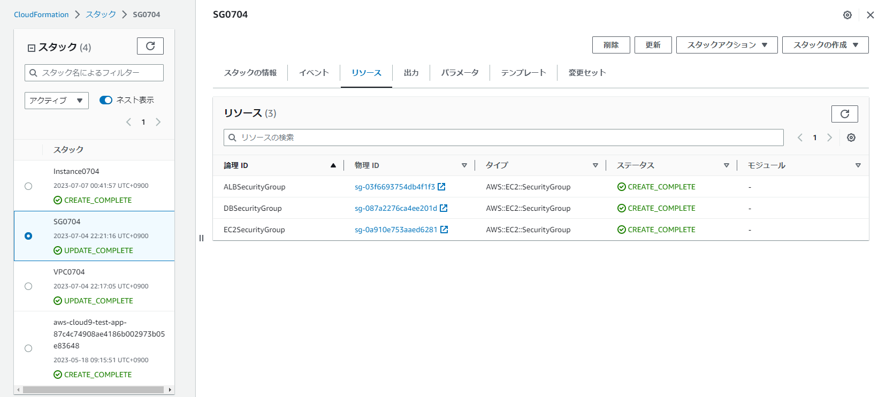

# 第１０回課題

## はじめに

* 第５回課題で構成した以下の構成図の環境をCloudFormationで再現した。<br>


* __VPC、セキュリティグループ、インスタンスの３スタック構成とした。__
<br>
<br>

## 各テンプレートについて
<br>

### VPC関係のテンプレート
<br>

1. フォーマットバージョンの設定
```
AWSTemplateFormatVersion: '2010-09-09'
```

* 2010-09-09が最新かつ唯一指定できるバージョン

<br>

2. VPCの作成
```
Resources:
#------------------------------------------------------
#  VPC
#------------------------------------------------------
  VPC1:
    Type: AWS::EC2::VPC
    Properties:
      CidrBlock: 172.31.0.0/16
```

* CidrBlockは第５回の課題のVPCと同様とした。以下、CidrBlockを指定する場合は基本的に第５回と合わせている。

<br>

3. Subnetの作成
```
#------------------------------------------------------
#  Subnet
#------------------------------------------------------
  PublicSubnetC:
    Type: AWS::EC2::Subnet
    Properties:
      AvailabilityZone: "ap-northeast-1c"
      CidrBlock: 172.31.0.0/20
      MapPublicIpOnLaunch: 'true'
      VpcId: !Ref VPC1

  PrivateSubnetC:
    Type: AWS::EC2::Subnet
    Properties:
      AvailabilityZone: "ap-northeast-1c"
      CidrBlock: 172.31.48.128/25
      MapPublicIpOnLaunch: 'false'
      VpcId: !Ref VPC1   

  PublicSubnetA:
    Type: AWS::EC2::Subnet
    Properties:
      AvailabilityZone: "ap-northeast-1a"
      CidrBlock: 172.31.32.0/20
      MapPublicIpOnLaunch: 'true'
      VpcId: !Ref VPC1

  PrivateSubnetA:
    Type: AWS::EC2::Subnet
    Properties:
      AvailabilityZone: "ap-northeast-1a"
      CidrBlock: 172.31.48.0/25
      MapPublicIpOnLaunch: 'false'
      VpcId: !Ref VPC1
```

* 2AZ構成としたため、PublicSubnet×２，PrivateSubnet×２を作成。
* MapPublicIpOnLaunch：AWSマネジメントコンソールにおける「パブリックIPv4アドレスの自動割り当てを有効にする」にチェックを入れるかどうかに相当。PublicSubnetはtrue、PrivateSubnetはfalseとする。
* !Refを使用すると参照される側（ここではVPC1）が作成されてからサブネットを作成するといったような、依存関係も自動的に処理される。

<br>

4. InternetGatewayの作成
```
#------------------------------------------------------
#  InternetGateway
#------------------------------------------------------
  InternetGateway:
    Type: AWS::EC2::InternetGateway
    
  AttachGateway:
    Type: AWS::EC2::VPCGatewayAttachment
    Properties:
      InternetGatewayId: !Ref InternetGateway
      VpcId: !Ref VPC1
```

* AttachGatewayの部分でAWS::EC2::VPCGatewayAttachmentを使ってインターネットゲートウェイをVPCにアタッチ。

<br>

5. PublicSubnetのRouteTableの作成
```
#------------------------------------------------------
#  RouteTable(PublicSubnet)
#------------------------------------------------------
  RouteTableForPublicSubnetC:
    Type: AWS::EC2::RouteTable
    Properties:
      VpcId: !Ref VPC1
  RouteForPublicSubnetC:
    Type: AWS::EC2::Route
    Properties:
      RouteTableId: !Ref RouteTableForPublicSubnetC
      DestinationCidrBlock:  0.0.0.0/0
      GatewayId: !Ref InternetGateway
  AssocciateRouteTableForPublicSubnetC:
    Type: AWS::EC2::SubnetRouteTableAssociation
    Properties:
      SubnetId: !Ref PublicSubnetC
      RouteTableId: !Ref RouteTableForPublicSubnetC

  RouteTableForPublicSubnetA:
    Type: AWS::EC2::RouteTable
    Properties:
      VpcId: !Ref VPC1
  RouteForPublicSubnetA:
    Type: AWS::EC2::Route
    Properties:
      RouteTableId: !Ref RouteTableForPublicSubnetA
      DestinationCidrBlock:  0.0.0.0/0
      GatewayId: !Ref InternetGateway
  AssocciateRouteTableForPublicSubnetA:
    Type: AWS::EC2::SubnetRouteTableAssociation
    Properties:
      SubnetId: !Ref PublicSubnetA
      RouteTableId: !Ref RouteTableForPublicSubnetA
```

* RouteTableForPublicSubnetでリソースタイプを指定し、どのVPCに作るかを!Refで指定した。
* DestinationCidrBlock：設定しないとエラーになるので記載。デフォルトゲートウェイをインターネットゲートウェイに関連付けてインターネットに向けて通信できるようにする。
* 作成したルートテーブルはどのサブネットにも関連付けされていないので、AWS::EC2::SubnetRouteTableAssociationでルートテーブルとパブリックサブネットを関連付ける。

<br>

【参考】デフォルトゲートウェイについて
* 異なるネットワークをつなぐための出入り口となるための機器/役割。宛先の不明なIPを転送するためにいったん集約する場所。
* ルーティングテーブル参照の結果、<br>
A. 宛先が同じネットワークの場合→デフォルトゲートウェイを介さずにパケットを送信する。<br>
B. 宛先が違うネットワークの場合→ルーティングテーブルに記載されているデフォルトゲートウェイに転送する。<br>
* 今回の場合は、インターネットゲートウェイがデフォルトゲートウェイとして機能。

<br>

6. PrivateSubnetのRouteTableの作成
```
#------------------------------------------------------
#  RouteTable(PrivateSubnet)
#------------------------------------------------------
  RouteTableForPrivateSubnetC:
    Type: AWS::EC2::RouteTable
    Properties:
      VpcId: !Ref VPC1
  AssocciateRouteTableForPrivateSubnetC:
    Type: AWS::EC2::SubnetRouteTableAssociation
    Properties:
      SubnetId: !Ref PrivateSubnetC
      RouteTableId: !Ref RouteTableForPrivateSubnetC

  RouteTableForPrivateSubnetA:
    Type: AWS::EC2::RouteTable
    Properties:
      VpcId: !Ref VPC1
  AssocciateRouteTableForPrivateSubnetA:
    Type: AWS::EC2::SubnetRouteTableAssociation
    Properties:
      SubnetId: !Ref PrivateSubnetA
      RouteTableId: !Ref RouteTableForPrivateSubnetA
```

<br>

7. 別のスタックへOutput
```
#------------------------------------------------------
#  別のスタックへOUTPUT
#------------------------------------------------------
Outputs:
  VPC1Output:
    Value: !Ref VPC1
    Export:
      Name: VPC0704-VPC1
  PublicSubnetCOutput:
    Value: !Ref PublicSubnetC
    Export:
      Name: VPC0704-PublicSubnetCId
  PrivateSubnetCOutput:
    Value: !Ref PrivateSubnetC
    Export:
      Name: VPC0704-PrivateSubnetCId
  PublicSubnetAOutput:
    Value: !Ref PublicSubnetA
    Export:
      Name: VPC0704-PublicSubnetAId
  PrivateSubnetAOutput:
    Value: !Ref PrivateSubnetA
    Export:
      Name: VPC0704-PrivateSubnetAId
```

* Outputsセクションに出力を定義することによって 1 つ以上の値を返す。（公式ドキュメント参照）
* どのリソースのPropertyをOutputするかを事前に決めておくとスムーズにテンプレートが作れると思った。今回は、あとからOutputするPropertyが増えてしまったため、一度作成したスタックを適宜更新することとなり、時間がかかってしまった。

<br>

### SecurityGroup関係のテンプレート
<br>

1. EC2インスタンスのSecurityGroup
```
AWSTemplateFormatVersion: '2010-09-09'
Resources:
#------------------------------------------------------
#  SecurityGroup(EC2Instance)
#------------------------------------------------------
  EC2SecurityGroup:
      Type: AWS::EC2::SecurityGroup
      Properties:
        GroupDescription: Security group for public
        SecurityGroupEgress:
          - CidrIp: 0.0.0.0/0
            Description: Allow all outbound traffic by default
            IpProtocol: "-1"
        SecurityGroupIngress:
          - CidrIp: 0.0.0.0/0
            Description: from 0.0.0.0/0:80
            FromPort: 80
            IpProtocol: tcp
            ToPort: 80
          - CidrIp: 192.168.240.170/32
            Description: from 0.0.0.0/0:22
            FromPort: 22
            IpProtocol: tcp
            ToPort: 22
        VpcId: !ImportValue VPC0704-VPC1
```

* SecurityGroupEgress：アウトバウンドルールを宣言する。IpProtocolを”-1”とすることで、すべてのプロトコルの通信を許可する。
* SecurityGroupIngress：インバウンドルールを宣言する。ポート番号3306は、RDSのDBエンジンがMySQLの場合のデフォルトのもの。
* 192.168.240.170はローカルのPCのIPアドレス。/32とすることで単一のIPを表す。

<br>

2. DBインスタンスのSecurityGroup
```
#------------------------------------------------------
#  SecurityGroup(DBInstance)
#------------------------------------------------------
  DBSecurityGroup:
    Type: AWS::EC2::SecurityGroup
    Properties:
      GroupDescription: Security group for private
      SecurityGroupIngress:
        - SourceSecurityGroupId: !Ref EC2SecurityGroup
          Description: connection to RDS
          FromPort: 3306
          IpProtocol: tcp
          ToPort: 3306
      VpcId: !ImportValue VPC0704-VPC1
```

* MySQLのデフォルトのポート番号をEC2のパブリックIPで許可しておく。

<br>

3. ALBのSecurityGroup
```
#------------------------------------------------------
#  SecurityGroup(ALB)
#------------------------------------------------------
  ALBSecurityGroup:
    Type: AWS::EC2::SecurityGroup
    Properties:
      GroupName: MyLoadBalancerSecurityGroup
      GroupDescription: Security group for the ALB
      VpcId: !ImportValue VPC0704-VPC1
      SecurityGroupIngress:
        - IpProtocol: tcp
          FromPort: 80
          ToPort: 80
          CidrIp: 0.0.0.0/0
```

<br>

4. 別のスタックへOutput
```
#------------------------------------------------------
#  別のスタックへOUTPUT
#------------------------------------------------------
Outputs:
  EC2SecurityGroupOutput:
    Value: !Ref EC2SecurityGroup
    Export:
      Name: SG0704-EC2SG
  DBSecurityGroupOutput:
    Value: !Ref DBSecurityGroup
    Export:
      Name: SG0704-DBSG
  ALBSecurityGroupOutput:
    Value: !Ref ALBSecurityGroup
    Export:
      Name: SG0704-ALBSG
```

* SG0704-EC2SGでEC2のセキュリティグループを他のスタックへOutputする。
* VPC関係のテンプレートでも値を出力していたので、どのスタックからの出力かを区別するために、ExportNameにはスタック名をつける。
* スタック名はExportNameで出力するものと同一のものをスタック作成時に指定する。

<br>

### Instance関係のテンプレート

1. ParameterセクションにDBのMasterUserNameとMasterpasswordを設定する
```
AWSTemplateFormatVersion: '2010-09-09'
Parameters:
#------------------------------------------------------
#  DBMasterUsername、DBMasteruserpassword
#------------------------------------------------------
  DBMasterUsername:
    Type: String
    Description: Enter the master username for the database.
    AllowedPattern: "^[a-zA-Z][a-zA-Z0-9]*$"
    ConstraintDescription: The username must start with a letter and can only contain letters and numbers.
  DBMasterPassword:
    Type: String
    Description: Enter the master password for the database.
    AllowedPattern: "^(?=.*[a-zA-Z])(?=.*[0-9]).{8,}$"
    ConstraintDescription: The password must be at least 8 characters long and contain at least one letter and one number.
```

* 今回テンプレートのymlファイルをGitHubに公開状態でPushするため、ResourceセクションでDBのPasswordとUsernameを指定せず、スタック作成時に作成者が設定するようにした。

<br>

2. キーペアを新規作成
```
Resources:
#------------------------------------------------------
#  KeyPair
#------------------------------------------------------
  NewKeyPair:
    Type: AWS::EC2::KeyPair
    Properties:
      KeyName: KeyPair0704
```

* キーペアの設定方法はA. 新しくキーペアを作成する場合、B. 既存のキーペアをインポートする場合の２通りある。

* 今回は、既存のキーペアを使う場合、公開鍵をテンプレートに記載することになるため、それを避けるために新しくキーペアを作成した。

* シンプルなテンプレートとするため、Parameterセクションは使わないこととした。

A. 新しくキーペアを作成する場合<br>
* Parametersセクションでパラメータを指定する場合(パターン1)、パラメータを指定しない場合（パターン2）がある。

<br>

■パターン1■

* キーペアの名前を外部から指定する必要がある場合に適している。

* スタックの作税時にキーペアの名前を入力できるようになる。

<br>

```
Parameters:
  KeyName:
    Type: String
    Description: Please enter a name for the new key pair.
Resources:
  MyKeyPair:
    Type: AWS::EC2::KeyPair
    Properties:
      KeyName: !Ref KeyName
```

<br>

* Parametersセクションで”KeyName”というパラメータを定義し、スタックの作成時にユーザーが新しいキーペアの名前を入力できるようにしている。

* 入力されたキーペア名は、ResourcesセクションでMyKeyPairリソースのKeyNameプロパティに!Refを使用して参照される。

<br>

■パターン2■

* 事前に特定のキーペア名を指定して新しいキーペアを作成する場合に適している。

* キーペアの名前を直接テンプレート内のResourcesセクションで指定する。

<br>

```
Resources:
  MyKeyPair:
    Type: AWS::EC2::KeyPair
    Properties:
      KeyName: MyNewKeyPair
```

<br>

* この場合は、キーペアの名前を”MyNewKyePair”として直接指定している。

<br>

B. 既存のキーペアを使う場合
```
Resources:
  ImportedKeyPair:
    Type: AWS::EC2::KeyPair
    Properties:
      KeyName: NameForMyImportedKeyPair
      PublicKeyMaterial: "ssh-ed25519 AAAAC3NzaC1lZDI1NTE5AAAAICfp1F7DhdWZdqkY　example"
```
<br>

* プロパティのKeyNameにインポートするキーペアの名前を指定する。

* PublicKeyMaterialに公開鍵を指定する。

<br>

3. EC2インスタンスを作成
```
#------------------------------------------------------
#  EC2Instance
#------------------------------------------------------
  EC2Instance1:
    Type: AWS::EC2::Instance
    Properties:
      ImageId: ami-08928044842b396f0
      InstanceType: t2.micro
      KeyName: !Ref NewKeyPair
      SecurityGroupIds: 
        -  !ImportValue SG0704-EC2SG
      SubnetId: !ImportValue VPC0704-PublicSubnetCId
```

* amiIDは第５回課題で作成したEC2インスタンスのものを利用した。

<br>

4. DBSubnetGroupの作成
```
#------------------------------------------------------
#  DBSubnetGroup
#------------------------------------------------------
  DBSubnetGroup:
    Type: AWS::RDS::DBSubnetGroup
    Properties:
      DBSubnetGroupName: DBSubnetGroup1
      DBSubnetGroupDescription: Subnet group for RDS database
      SubnetIds: 
      -  !ImportValue VPC0704-PrivateSubnetCId
      -  !ImportValue VPC0704-PrivateSubnetAId
```

* VPC関係のテンプレートで定義した2つのPrivateSubnetを指定した。

<br>

5. DBインスタンスの作成
```
#------------------------------------------------------
#  DBInstance
#------------------------------------------------------
  DBInstance1:
    Type: AWS::RDS::DBInstance
    Properties:
      VPCSecurityGroups: 
      -  !ImportValue SG0704-DBSG
      DBSubnetGroupName: !Ref DBSubnetGroup
      DBInstanceClass: db.t2.micro
      AllocatedStorage: 10
      Engine: MySQL
      MasterUsername: !Ref DBMasterUsername
      MasterUserPassword: !Ref DBMasterPassword
```

<br>

6. ALBの作成
```
#------------------------------------------------------
#  ALB
#------------------------------------------------------
  ALB1:
    Type: AWS::ElasticLoadBalancingV2::LoadBalancer
    Properties:
      Name: ALB1
      Scheme: internet-facing
      Type: application
      Subnets: 
        -  !ImportValue VPC0704-PublicSubnetCId
        -  !ImportValue VPC0704-PublicSubnetAId
      SecurityGroups: 
        -  !ImportValue SG0704-DBSG
```

* ALBは作成時に2つのサブネットを必ず指定しないといけない。

<br>

7. ALBのTargetGroupの作成
```
#------------------------------------------------------
#  TargetGroup
#------------------------------------------------------
  TargetGroup:
    Type: AWS::ElasticLoadBalancingV2::TargetGroup
    Properties:
      Port: 80
      Protocol: HTTP
      ProtocolVersion: HTTP1
      TargetType: instance
      Targets:
        -  Id: !Ref EC2Instance1
      VpcId: !ImportValue VPC0704-VPC1
      HealthCheckEnabled: true
      HealthCheckIntervalSeconds: 30
      HealthCheckPath: /
      HealthCheckPort: traffic-port
      HealthCheckProtocol: HTTP
      HealthCheckTimeoutSeconds: 5
      HealthyThresholdCount: 5
      UnhealthyThresholdCount: 2
      Matcher: 
        HttpCode: 200,301
```

<br>

8. ALBのListenerの作成
```
#------------------------------------------------------
#  HTTPListener
#------------------------------------------------------
  HTTPListener:
      Type: AWS::ElasticLoadBalancingV2::Listener
      Properties:
        DefaultActions:
          - Type: 'forward'
            TargetGroupArn: !Ref TargetGroup
        LoadBalancerArn: !Ref ALB1
        Port: '80'
        Protocol: 'HTTP'
```

* forwardをTypeに指定することで、ALBはTargetGroupに指定したTargetにリクエストを転送する。

<br>

9. S3Bucketの作成
```
#------------------------------------------------------
#  S3Bucket
#------------------------------------------------------
  S3Bucket1:
    Type: AWS::S3::Bucket
    Properties:
      BucketName: s3bucketraaisetech0704zyui
      AccessControl: Private
      PublicAccessBlockConfiguration:
        BlockPublicAcls: true
        BlockPublicPolicy: true
        IgnorePublicAcls: true
        RestrictPublicBuckets: true
```

* BucketNameは全世界で一意でなければならず、かつ大文字は使えないことに注意して設定する。

<br>

## テンプレートの完成形

* lecture10.mdとともにPushした３つのymlファイルが今回のテンプレートの完成形である。

## 課題のエビデンス

* VPC関係のスタック


<br>

* SecurityGroup関係のスタック



<br>

* Instance関係のスタック


