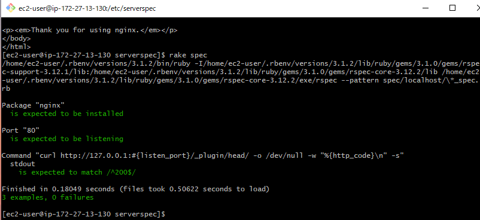

# 第１１回課題

## Serverspecのインストール方法

### EC2をダッシュボードで開始し、SSHクライアントでSSH接続する
```
ssh -i keypair-1.pem ec2-user@ec2-13-114-231-203.ap-northeast-1.compute.amazonaws.com
```

* keypair-1.pemはkeypairの相対パスを指定する。

<br>

### 事前準備

* RubyやNginxをインストールしておく

<br>

### Serverspecをinstall
```
gem install serverspec
```

* ~/.gem/ruby/gemsディレクトリ以下にライブラリがインストールされ、Rubyスクリプトからserverspecモジュールが利用できるようになる。

<br>

### Serverspecの初期セットアップ
```
serverspec-init
```

* serverspec-initコマンドで、テストスクリプトのひな形を生成する。

<br>

### Serverspec-init

* serverspec-initコマンドを実行すると、OSタイプなどを選択することになる。<br>

* OSはEC2インスタンスのOSがAmazon Linux2なので1を選択する。<br>

* backend typeは2を選択する。

```
Select OS type:

  1) UN*X
  2) Windows

Select number: 1

Select a backend type:

  1) SSH
  2) Exec (local)

Select number: 2

 + spec/
 + spec/localhost/
 + spec/localhost/sample_spec.rb
/home/ec2-user/.rbenv/versions/3.1.2/lib/ruby/gems/3.1.0/gems/serverspec-2.42.2/lib/serverspec/setup.rb:155: warning: Passing safe_level with the 2nd argument of ERB.new is deprecated. Do not use it, and specify other arguments as keyword arguments.
/home/ec2-user/.rbenv/versions/3.1.2/lib/ruby/gems/3.1.0/gems/serverspec-2.42.2/lib/serverspec/setup.rb:155: warning: Passing trim_mode with the 3rd argument of ERB.new is deprecated. Use keyword argument like ERB.new(str, trim_mode: ...) instead.
 + spec/spec_helper.rb
 + Rakefile
 + .rspec
```

<br>


### テストの成功を確認

* sample_spec.rbをサンプルのものに書き換える。ただし、Nginxを80番ポートでリッスンさせるため、ポート番号を80に変更。

* テストコードは以下を使った。
```
require 'spec_helper'

listen_port = 8080

describe package('nginx') do
  it { should be_installed }
end

describe port(listen_port) do
  it { should be_listening }
end

describe command('curl http://127.0.0.1:#{listen_port}/_plugin/head/ -o /dev/null -w "%{http_code}\n" -s') do
  its(:stdout) { should match /^200$/ }
end
```

<br>

* テストを実行して成功を確認した。


