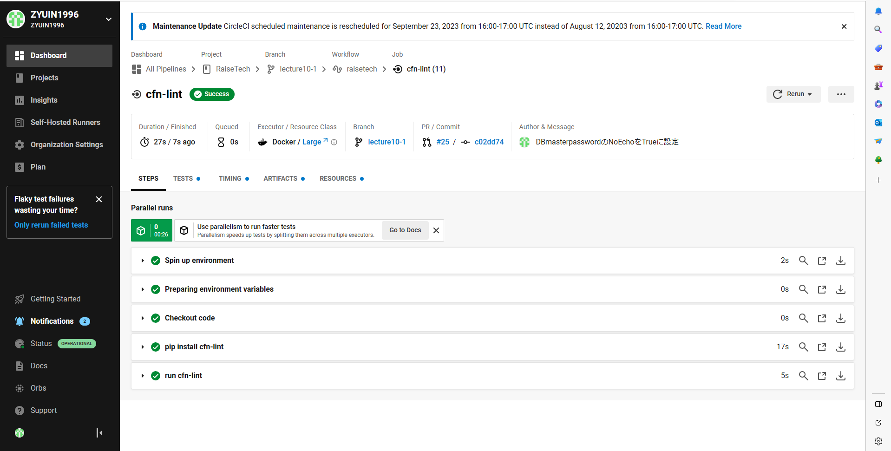

# 第１２回課題

* CircleCIのサンプルコンフィグによってCloudFormationのテンプレートをテストした。

## テストの実行手順

### CircleCIとGitHubのリモートリポジトリを連携させる。

### config.ymlをGitHubのリモートリポジトリにPush

* サンプルコンフィグのテンプレート名を修正して以下のconfig.ymlによってテストした。

```
version: 2.1
orbs:
  python: circleci/python@2.0.3
jobs:
  cfn-lint:
    executor: python/default
    steps:
      - checkout
      - run: pip install cfn-lint
      - run:
          name: run cfn-lint
          command: |
            cfn-lint -i W3002 -t 01_create_vpc.yml
            cfn-lint -i W3002 -t 02_create_securitygroup.yml
            cfn-lint -i W3002 -t 03_create_instance.yml
workflows:
  raisetech:
    jobs:
      - cfn-lint
```

<br>

* ディレクトリ構成は.gitディレクトリと同じ階層に.circleciディレクトリを作成し、.circleciディレクトリ内にconfig.ymlを配置。

* config.ymlをこれまでと同様にadd＆commit＆pushする。

### テンプレートファイルを修正

* プルリクエストを作成するとcfn-lintが自動的に実行される。

* テンプレートの書き方がまずかったため、テンプレートを修正してPushした。修正内容は以下の通り。

1. サブネットを配置するAZをハードコードで書いていたため、AZをパラメータ化することとした。

【修正前】<br>
```
#------------------------------------------------------
#  Subnet
#------------------------------------------------------
Resources:
  PublicSubnetC:
    Type: AWS::EC2::Subnet
    Properties:
      AvailabilityZone: "ap-northeast-1c"
      CidrBlock: 172.31.0.0/20
      MapPublicIpOnLaunch: 'true'
      VpcId: !Ref VPC1

  PrivateSubnetC:
    Type: AWS::EC2::Subnet
    Properties:
      AvailabilityZone: "ap-northeast-1c"
      CidrBlock: 172.31.48.128/25
      MapPublicIpOnLaunch: 'false'
      VpcId: !Ref VPC1   

  PublicSubnetA:
    Type: AWS::EC2::Subnet
    Properties:
      AvailabilityZone: "ap-northeast-1a"
      CidrBlock: 172.31.32.0/20
      MapPublicIpOnLaunch: 'true'
      VpcId: !Ref VPC1

  PrivateSubnetA:
    Type: AWS::EC2::Subnet
    Properties:
      AvailabilityZone: "ap-northeast-1a"
      CidrBlock: 172.31.48.0/25
      MapPublicIpOnLaunch: 'false'
      VpcId: !Ref VPC1
```
<br>

【修正後】
```
Parameters:
#------------------------------------------------------
#  AvalabilityZone
#------------------------------------------------------
  AvailabilityZoneA:
    Type: String
    Default: ap-northeast-1a
    AllowedValues:
      - ap-northeast-1a
      - ap-northeast-1c
  AvailabilityZoneC:
    Type: String
    Default: ap-northeast-1c
    AllowedValues:
      - ap-northeast-1a
      - ap-northeast-1c
Resources:
#------------------------------------------------------
#  Subnet
#------------------------------------------------------
  PublicSubnetC:
    Type: AWS::EC2::Subnet
    Properties:
      AvailabilityZone: !Ref AvailabilityZoneC
      CidrBlock: 172.31.0.0/20
      MapPublicIpOnLaunch: 'true'
      VpcId: !Ref VPC1

  PrivateSubnetC:
    Type: AWS::EC2::Subnet
    Properties:
      AvailabilityZone: !Ref AvailabilityZoneC
      CidrBlock: 172.31.48.128/25
      MapPublicIpOnLaunch: 'false'
      VpcId: !Ref VPC1   

  PublicSubnetA:
    Type: AWS::EC2::Subnet
    Properties:
      AvailabilityZone: !Ref AvailabilityZoneA
      CidrBlock: 172.31.32.0/20
      MapPublicIpOnLaunch: 'true'
      VpcId: !Ref VPC1

  PrivateSubnetA:
    Type: AWS::EC2::Subnet
    Properties:
      AvailabilityZone: !Ref AvailabilityZoneA
      CidrBlock: 172.31.48.0/25
      MapPublicIpOnLaunch: 'false'
      VpcId: !Ref VPC1
```
<br>

2. DBのMasterpasswordのNoEchoをTrueにした。

【修正後】
```
Parameters:
#------------------------------------------------------
#  DBMasterUsername、DBMasteruserpassword
#------------------------------------------------------
  DBMasterUsername:
    Type: String
    Description: Enter the master username for the database.
    AllowedPattern: "^[a-zA-Z][a-zA-Z0-9]*$"
    ConstraintDescription: The username must start with a letter and can only contain letters and numbers.
  DBMasterPassword:
    Type: String
    Description: Enter the master password for the database.
    AllowedPattern: "^(?=.*[a-zA-Z])(?=.*[0-9]).{8,}$"
    ConstraintDescription: The password must be at least 8 characters long and contain at least one letter and one number.
    NoEcho: True
```

<br>

### テストの成功を確認


       